<div align="center">

<!--  H E A D E R
      Custom SVG — upload header.svg to this repo root
      Animated isometric cubes · glitch name · CSS keyframes  -->


<br/>

<!--  T Y P I N G  — demolab, reliable  -->
[](https://github.com/SkyonixTheKing23)

<br/>

<!--  B A D G E S  — shields.io, 100% reliable  -->

&nbsp;
[](https://github.com/SkyonixTheKing23?tab=followers)
&nbsp;
[](https://github.com/SkyonixTheKing23)

</div>

<br/>

---

<div align="center">

```
▸  WHO AM I  ◂
```

</div>

<br/>

<table align="center" width="100%">
<tr>
<td width="50%" valign="top">

```yaml
# identity.yml
name:     Soulaiman
alias:    Skyonix
title:    Void Architect
location: Morocco 🇲🇦  ·  GMT+1

status:
  system:  ● ONLINE
  current: Building impossible UIs
  mood:    🔥 Locked In

philosophy:
  - "60fps or it doesn't ship"
  - "If it doesn't glow, rethink it"
  - "Performance IS a feature"
```

</td>
<td width="50%" valign="top">

```yaml
# stack.yml
threed:    [Spline, Three.js, WebGL]
frontend:  [React 19, Next.js, Vite]
motion:    [Framer Motion, GSAP]
backend:   [Node.js, Python]
styling:   [Tailwind, Vanilla CSS]
tools:     [Git, Figma, Docker]

building_now:
  - Skyonix Portfolio V2  ★
  - Three.js shader experiments

open_to:
  - Freelance & remote work
  - Collabs & open source
```

</td>
</tr>
</table>

<br/>

---

<div align="center">

```
▸  TECH STACK  ◂
```

<br/>


</div>

<br/>

---

<div align="center">

```
▸  SKILL LEVELS  ◂
```

</div>

<br/>

```
  CSS · Animations      ▰▰▰▰▰▰▰▰▰▰▰▰▰▰▰▰▰▰▰▰▰▱   95%   ✨ Master
  React · Next.js       ▰▰▰▰▰▰▰▰▰▰▰▰▰▰▰▰▰▰▰▰▱▱   90%   ⚡ Expert
  Framer · GSAP         ▰▰▰▰▰▰▰▰▰▰▰▰▰▰▰▰▰▰▰▰▱▱   90%   🔥 Expert
  Performance Opt.      ▰▰▰▰▰▰▰▰▰▰▰▰▰▰▰▰▰▰▰▰▱▱   90%   🚀 Expert
  UI · UX Design        ▰▰▰▰▰▰▰▰▰▰▰▰▰▰▰▰▰▰▱▱▱▱   80%   🎨 Advanced
  Three.js · WebGL      ▰▰▰▰▰▰▰▰▰▰▰▰▰▰▰▰▱▱▱▱▱▱   75%   🌌 Advanced
  TypeScript            ▰▰▰▰▰▰▰▰▰▰▰▰▰▰▰▱▱▱▱▱▱▱   70%   💪 Advanced
  Node.js · Backend     ▰▰▰▰▰▰▰▰▰▰▰▰▱▱▱▱▱▱▱▱▱▱   60%   📈 Growing
```

<br/>

---

<div align="center">

```
▸  GITHUB STATS  ◂
```

<br/>


&nbsp;


<br/><br/>


</div>

<br/>

---

<div align="center">

```
▸  FEATURED PROJECT  ◂
```

</div>

<br/>

<div align="center">

```
  ╔═════════════════════════════════════════════════════════════════╗
  ║                                                                 ║
  ║   🚀  SKYONIX PORTFOLIO V2                                      ║
  ║       skyonix-studio.netlify.app                                ║
  ║                                                                 ║
  ╠═════════════════════════════════════════════════════════════════╣
  ║                                                                 ║
  ║   ►  Interactive 3D robot hero — Spline / WebGL                 ║
  ║   ►  Glassmorphic cyberpunk UI + dynamic neon glow              ║
  ║   ►  Locked at 60fps — adaptive pixel ratio on mobile           ║
  ║   ►  Spring-physics cursor trailer on desktop                   ║
  ║   ►  Glitch typewriter animation synced on load                 ║
  ║                                                                 ║
  ╚═════════════════════════════════════════════════════════════════╝
```

[](https://skyonix-studio.netlify.app/)
&nbsp;
[](https://github.com/SkyonixTheKing23/skyonix-portfolio)

</div>

<br/>

---

<div align="center">

```
▸  CONTRIBUTION SNAKE 🐍  ◂
```

<br/>

<picture>
  <source media="(prefers-color-scheme: dark)"
    srcset="https://raw.githubusercontent.com/SkyonixTheKing23/SkyonixTheKing23/output/github-contribution-grid-snake-dark.svg">
  <source media="(prefers-color-scheme: light)"
    srcset="https://raw.githubusercontent.com/SkyonixTheKing23/SkyonixTheKing23/output/github-contribution-grid-snake.svg">
  
</picture>

</div>

<br/>

---

<div align="center">

```
▸  COMMIT ACTIVITY  ◂
```

<br/>


</div>

<br/>

---

<div align="center">

```
▸  TROPHIES  ◂
```

<br/>


</div>

<br/>

---

<div align="center">

[](https://skyonix-studio.netlify.app/)
&nbsp;
[](https://www.linkedin.com/in/iamfrosty-the-king-878378301/)
&nbsp;
[](https://github.com/SkyonixTheKing23)

<br/>

```
[ SYSTEM_ONLINE: READY_TO_WORK ]
```

<br/>

</div>


